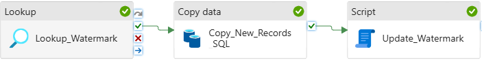
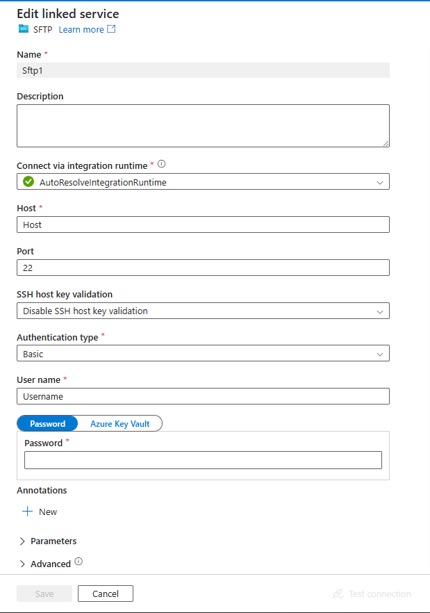

# Week 6: Azure Data Factory ETL Project

In this week's task, we designed an **ETL pipeline using Azure Data Factory (ADF)** to extract data from:

* An **on-premises SQL Server**
* An **SFTP server**

The extracted data was then loaded into:

* **Azure SQL Database**
* **Azure Data Lake Storage (ADLS)**

We implemented **incremental loading** to ensure that only **new or modified records** are processed. Additionally, we configured a **trigger** to automatically execute the pipeline on the **last Saturday of each month**.

> **Thanks to [CSI (Celebal Summer Internship)](https://www.celebaltech.com/)**
> This project helped me gain practical exposure to ADF's drag-and-drop, no-code ETL capabilities.
> I’m truly grateful for the opportunity to build and learn!

---

## Dataset Used

**NYC Restaurant Inspection Data**

* Selected because it is **updated monthly**, making it ideal for testing **incremental load** logic.

---

## Architecture Diagram

<p align="center">
  
</p>

---

## Pipelines Overview

* **Pipeline 1**: `Run_Pipeline_OnPrem_To_SQLDB`  
  Moves data from **on-premises SQL Server** to **Azure SQL Database**

* **Pipeline 2**: `Run_Pipeline_SFTP_To_ADLS`  
  Transfers files from **SFTP Server** into **Azure Data Lake Storage**

* **Master Pipeline**: Orchestrates both pipelines and schedules a **monthly trigger**

---

## Setup: Data Sources

### On-Premises SQL Server

* Configured using **SQL Server Management Studio (SSMS)**
* Loaded the NYC Restaurant dataset locally

### SFTP Server

* Set up using **WinSCP**
* Contains **3 CSV files**, each for a different year from the dataset

---

## Load Targets

### Azure SQL Database

* Deployed within the `week6` resource group
* Receives transformed and cleaned data

### Azure Data Lake Storage (ADLS)

* Organized into two directories:
  * `SFTP-DATA`
  * `Restaurant_Inspection`

---

## 🚀 Pipeline 1: On-Premises SQL Server → Azure SQL Database

<p align="center">
  
</p>

### 1. Linked Services

* **On-Premises SQL Server** (via Self-Hosted Integration Runtime)
* **Azure SQL Database**

<p align="center">
  
  
</p>

---

### 2. Datasets

* Source: `sqlservertable1`
* Sink: `azuresqltable1`

<p align="center">
  
  
</p>

---

### 3. Incremental Load Logic

We used a **watermark table** to capture the latest inspection date and load only new or updated records using **Lookup** and **Filter** activities.

#### Step 1: Lookup Watermark

```sql
SELECT MAX([INSPECTION DATE]) AS last_watermark
FROM dbo.NYC_Restaurant
```

#### Step 2: Filter New Records

```sql
SELECT *
FROM dbo.DOHMH_New_York_City_Restaurant_$
WHERE [INSPECTION DATE] > '@{activity('Lookup_Watermark').output.firstRow.last_watermark}'
```

#### Step 3: Update Watermark Table

```sql
UPDATE watermark_table
SET last_updated_time = (
    SELECT MAX([INSPECTION DATE])
    FROM dbo.NYC_Restaurant
)
WHERE table_name = 'NYC_NYC_Restaurant';
```

---

### ✅ Pipeline 1 Result

<p align="center">
  
  
</p>

---

## 📂 Pipeline 2: SFTP Server → Azure Data Lake Storage

<p align="center">
  
</p>

### 1. Linked Services

* **SFTP Server** (via Self-Hosted Integration Runtime)
* **ADLS Gen2**

<p align="center">
  
  
</p>

---

### 2. Datasets

* Source: CSV files from SFTP
* Sink: ADLS directories

<p align="center">
  
  
</p>

---

### 3. Copy Activity

* Transfers files from SFTP into ADLS folders

💡 **Optional Enhancement**: Incremental logic (similar to Pipeline 1) can be added using a **watermark** and **metadata tracking**.

---

### ✅ Pipeline 2 Result

<p align="center">
  
  
  
  
</p>

---

## 🧩 Master Pipeline + Trigger

<p align="center">
  
</p>

* Combines **Pipeline 1** and **Pipeline 2**
* Adds a **trigger** to schedule execution on the **last Saturday of each month** at **7:00 AM**

---

### Trigger Configuration

<p align="center">
  
</p>

* **Recurrence**: Monthly  
* **Day of Week**: Saturday  
* **Week of Month**: Last  
* **Time**: 7:00 AM  

---

### ✅ Trigger Run Result

<p align="center">
  
</p>

---

## ✅ Summary

| Task                      | Status         |
| ------------------------- | -------------- |
| On-Prem to Azure SQL DB   | ✅ Completed    |
| SFTP to ADLS Gen2         | ✅ Completed    |
| Incremental Load Logic    | ✅ Implemented  |
| Master Pipeline + Trigger | ✅ Configured   |

This task was a valuable hands-on experience in building and orchestrating **real-world ETL pipelines** with Azure Data Factory. It involved integrating multiple data sources, applying transformation logic, and setting up scheduled automation — all using ADF’s powerful low-code interface.
