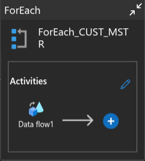
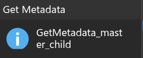
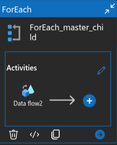

<h1 align="center"> Week 7: Truncate and Load ADF Pipeline </h1>

<p align="center">
  
</p>

## 📌 Project Overview

This week's assignment focused on building a **Truncate and Load pipeline using Azure Data Factory (ADF)** that executes on a **daily schedule**. The task required handling and processing three distinct types of `.csv` files stored in **Azure Data Lake Storage Gen2 (ADLS)**, involving dynamic metadata-driven design and conditional branching based on file structure.

### Key Concepts Practiced:

- Working with metadata activities
- Creating parameterized data flows
- Parsing file names for dynamic loading
- Implementing scheduled pipeline triggers
- Auto-extracting date components from filenames


## 🧠 Problem Statement

The solution involved dealing with the following three `.csv` file types:

| File Type               | Required Processing Logic                                                              |
| ----------------------- | -------------------------------------------------------------------------------------- |
| `CUST_MSTR_*.csv`       | Extract `file_date` → Convert `20191112` to `2019-11-12` → Load into `CUST_MSTR` table |
| `master_child_export-*` | Extract `file_date` and `date_key` from name → Load into `master_child` table          |
| `H_ECOM_ORDER.csv`      | Load the data as-is into `H_ECOM_Orders` table                                         |

📝 **Note**: Each table should be truncated before loading, and the pipeline is designed to run once per day.

> 🙏 Thanks to CSI (Celebal Technologies) for the opportunity to apply these concepts during the internship.

---

## 📂 Azure Resources Involved

- Azure Data Factory (ADF)
- Azure SQL Database + SQL Server
- Azure Data Lake Storage Gen2

<p align="center">
  
</p>


## 🔗 Linked Services

Set up connections for:

* Azure SQL DB
* Azure Data Lake Gen2

<p align="center">
  
</p>


## 🗂️ Datasets

Created datasets for:

- Reading input CSV files from ADLS
- Writing into SQL sink tables

<p align="center">
  
</p>

---

## 🧪 Pipeline Architecture

<p align="center">
  
</p>

This is the master pipeline that processes and loads all 3 types of files into their respective SQL tables on a daily basis.


## 🔁 CUST\_MSTR Flow

### ✅ Metadata Activity

<p align="center"></p>

📌 Dataset: `CUST_MSTR_CSV`

### ✅ ForEach + Data Flow

<p align="center"></p>

📌 Items:

```json
@activity('GetMetadata_CUST_MSTR').output.childItems
```

### ✅ Data Flow Logic

<p align="center"></p>

* **Derived Column**: `file_date`

```plaintext
toDate(
  replace(
    split(split(byName('source_file_name'), '/')[3], '_')[3],
    '.csv',
    ''
  ),
  'yyyyMMdd'
)
```

<p align="center"></p>


## 🔁 master\_child\_export Flow

### ✅ Metadata Activity

<p align="center"></p>

📌 Dataset: `master_child.csv`

### ✅ ForEach + Data Flow

<p align="center"></p>

📌 Items:

```json
@activity('GetMetadata_master_child').output.childItems
```

### ✅ Data Flow Logic

<p align="center"></p>

* **Derived Column**:

```plaintext
file_date: toDate(replace(split(split(byName('source_file_name'), '/')[3],'-')[2],'.csv',''),'yyyyMMdd')

date_key: replace(split(split(byName('source_file_name'), '/')[3],'-')[2],'.csv','')
```

<p align="center"></p>


## 🔁 H\_ECOM\_ORDER Flow

### ✅ Metadata Activity

<p align="center"></p>

📌 Dataset: `H_ECOM_ORDER.csv`

### ✅ ForEach + Data Flow

<p align="center"></p>

📌 Items:

```json
@activity('GetMetadata_H_ECOM_ORDER').output.childItems
```

### ✅ Data Flow Logic

<p align="center"></p>

* No transformation — load as-is

<p align="center"></p>


## ⏰ Trigger Configuration

This pipeline is triggered **daily** using a scheduled trigger.

<p align="center"></p>
<p align="center"></p>


## 🌟 Suggestions for Enhancement

- Configure alerts using Logic Apps for success/failure notifications
- Store file execution logs in an audit table with file name and row count
- Add global parameters and filter logic for full pipeline flexibility

---

## 💼 Author

**Mahiwal Vaishnav**\
Celebal Summer Internship 2025\
**Week 7 - Truncate and Load using Azure Data Factory**